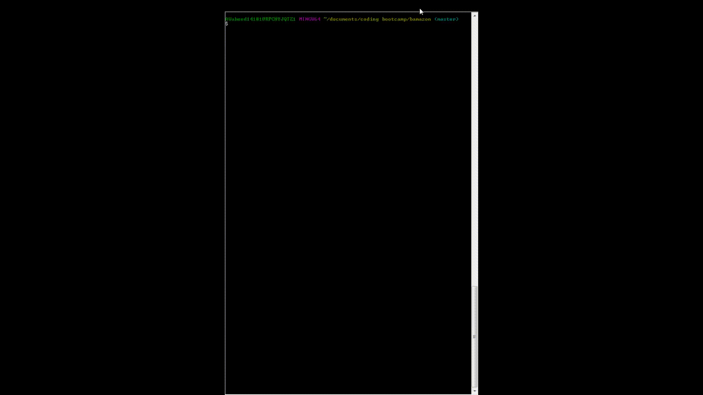
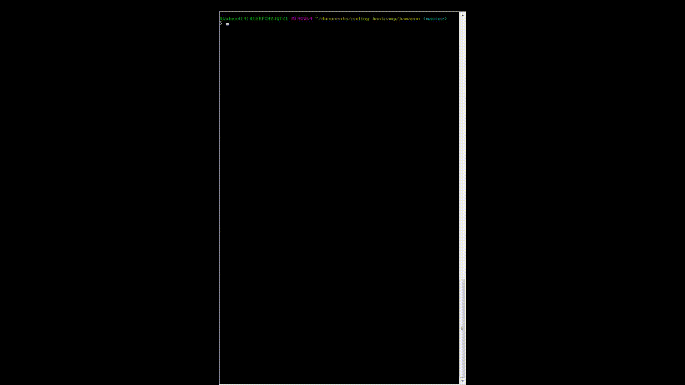

# Bamazon
A node app for shoping. The application is created in CLI and different prompts and validations are created to enhance UI/UX.

## Challenge #1: Customer View

## Challenge #2: Manager View 

## Challenge #3: Supervisor View 

